# Super Metroid item randomizer

A description of what you are up against:
- With randomized weapon drops and enemy weaknesses, you will find yourself switching items very often just to try to kill something, and hunting through rooms just to reload one particular weapon.

Depends on:
- LuaJIT
- my lua ext library
- my lua template library
- my lua ips library
- my lua image library, if you enable config.lua's writeOutImage

randomizes the following:
- enemies:
	- item drop percentages 
	- weaknesses / immunities / freeze capability
	- health
	- touch damage
	- shot damage
- item shuffle previous locations
- weapon damages
- doors (NOTICE the item accessibility search doesn't take this into account yet)
- item scavenger hunt mode.  Put items at any accessible in the map (99% of the time).  If randomizing doors had no guarantees, this has even less.
	- optionally hide the items
	- optionally burrow them into the wall so you just see the break block + start of the passage to get to them.

The item placement algorithm does a depth-first search to make sure that there is at least one possible run that will result in the game being won.

It takes into account required items to enter the room, to leave the room, enemy weaknesses (for grey doors), and what skills the player knows.

This doesn't mean that you can't get permanently stuck in a room.  It just means that somewhere you can access the item that you need to get unstuck.  So save often.

Item placement also allows you to replace certain items.  In case you wanted to see what a run through of Super Metroid was like with only 6 energy tanks.

Item placement also allows for changing the probability of placing an item.  In case you wanted to put all the super missiles and e-tanks at the end of the game.

Notice if you randomize enemy weaknesses, then the item search algorithm can get possibly get stuck if it ever encounters a situation where you need to kill a certain enemy to access an item, but you can never access the item required to kill that enemy.  This is because right now the weakness randomizer and the item placement randomizer are separate for now, but maybe I will let the item placement determine enemy weaknesses in the future.


My next goal is to randomize blocks in certain passageways.

### I have added a dump of all memory ranges that I am using -- in an attempt to better chart out the ROM:

[memory map](memorymap.txt)

### I've got rooms decompressing correctly.  Here's proof:

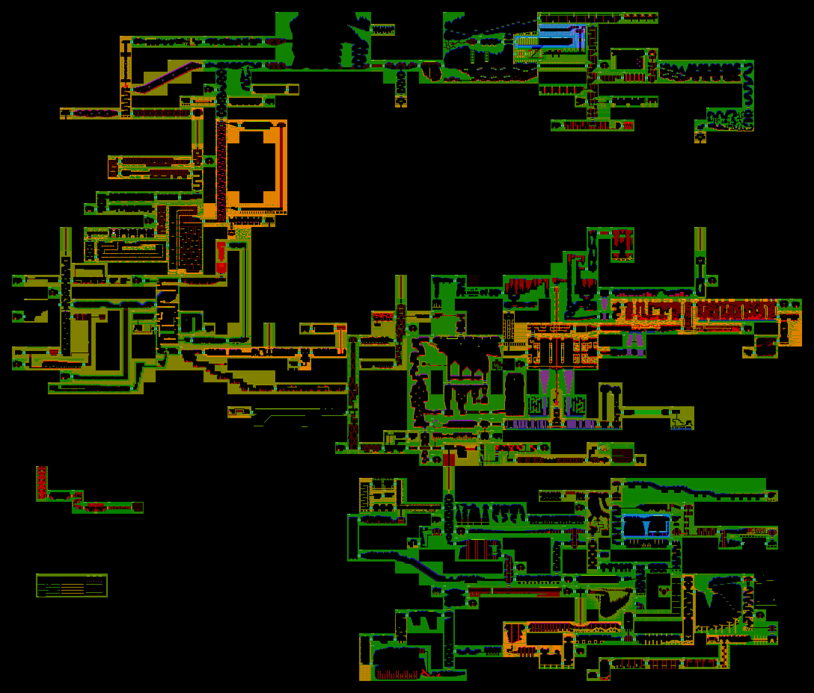

### And recompressing correctly: ###

```
common room graphics tiles + tilemaps + bg tilemaps recompressed from 46094 to 27188, saving 18906 bytes (new data is 58% of original size)
tileSet tilemap + graphicsTileSet + palettes recompressed from 243079 to 221753, saving 21326 bytes (new data is 91% of original size)
rooms recompressed from 385399 to 217597, saving 167802 bytes (new data is 56% of original size)
```

### And here's a connectivity graph of the rooms.  Multiple arrows means multiple roomstates.

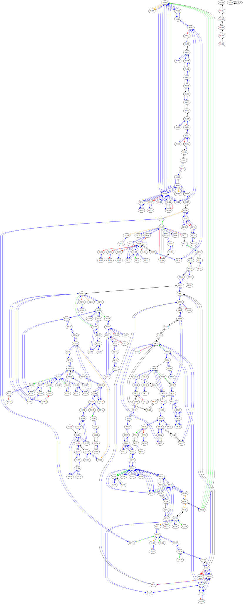


Here's the burrowed items in action:

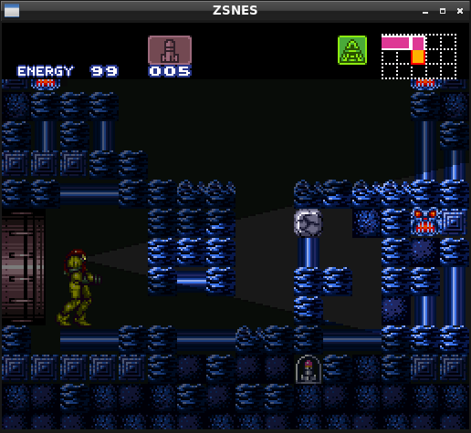
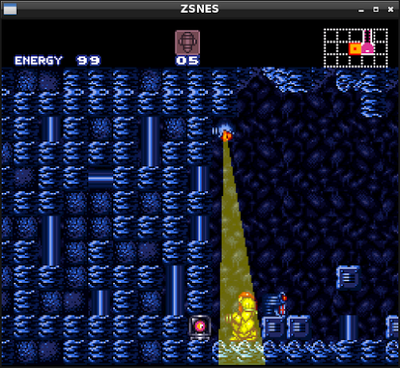
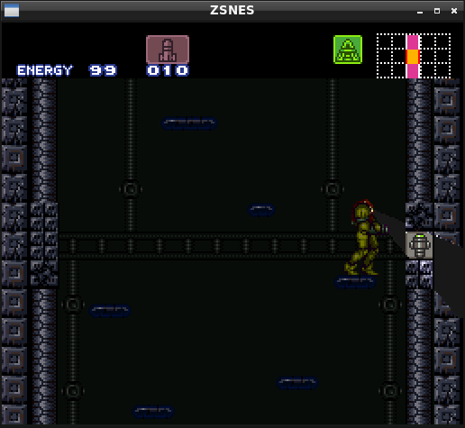
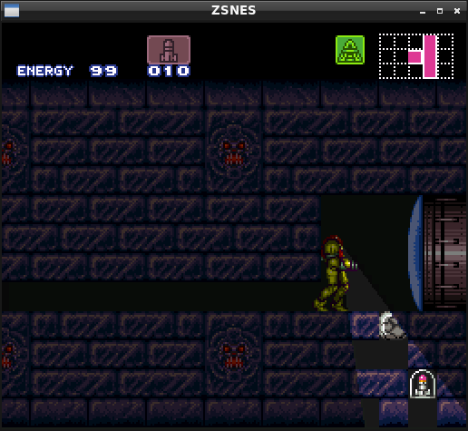
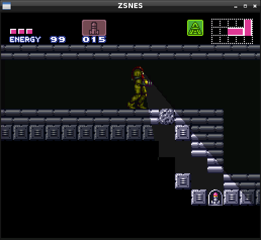
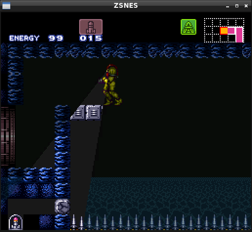

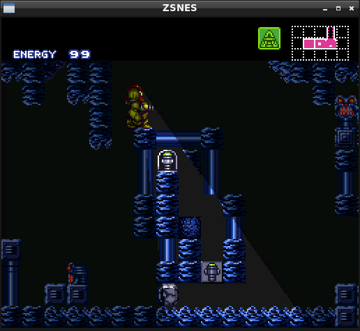
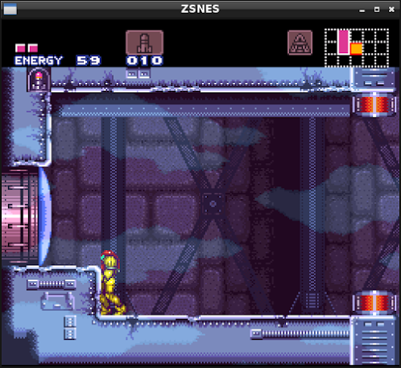
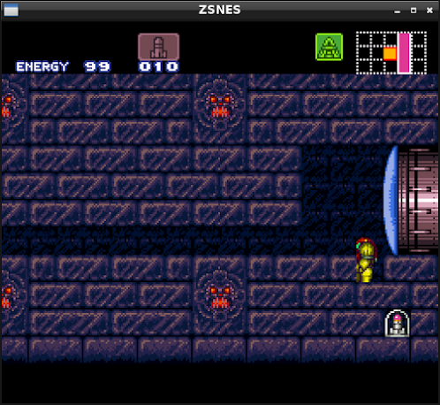
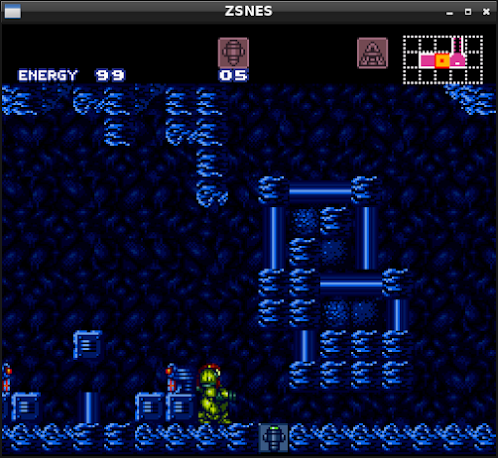
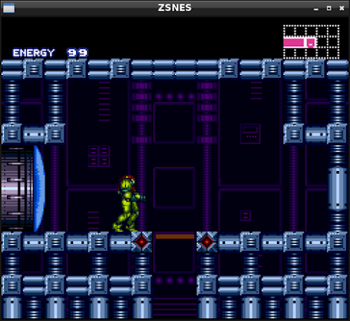
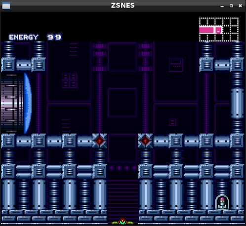
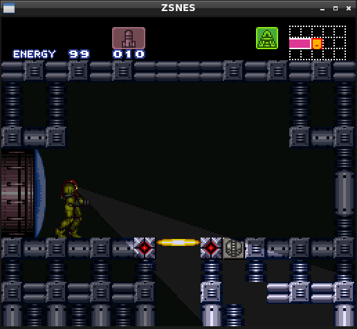


Sources: (you can find a full list with `grep http *`)
- http://deanyd.net/sm/index.php?title=List_of_rooms
- http://www.dkc-atlas.com/forum/viewtopic.php?t=1009
- https://gamefaqs.gamespot.com/snes/588741-super-metroid/faqs/39375%22
- https://github.com/tewtal/smlib/SMLib/ROMHandler.cs
- https://github.com/dansgithubuser/dansSuperMetroidLibrary/blob/master/sm.hpp
- https://github.com/tewtal/smlib especially SMLib/ROMHandler.cs
- http://metroidconstruction.com/SMMM/
- http://metroidconstruction.com/SMMM/ready-made_backgrounds.txt
- http://metroidconstruction.com/SMMM/fx_values.txt
- http://www.metroidconstruction.com/SMMM/index.php?css=black#door-editor
- http://www.metroidconstruction.com/SMMM/plm_disassembly.txt
- http://forum.metroidconstruction.com/index.php?topic=2476.0
- http://wiki.metroidconstruction.com/doku.php?id=super:enemy:list_of_enemies
- http://wiki.metroidconstruction.com/doku.php?id=super:technical_information:list_of_enemies
- http://wiki.metroidconstruction.com/doku.php?id=super:data_maps:rom_map:bank8f
- http://patrickjohnston.org/bank/index.html
- http://pikensoft.com/docs/Zelda_LTTP_compression_(Piken).txt
- http://www.romhacking.net/documents/243/
- https://jathys.zophar.net/supermetroid/kejardon/EnemyResistence.txt
